# video-game-sales-analysis
**Comprehensive EDA, Advanced SQL Analysis and Machine Learning (Hit Game Prediction) on Video Game Sales dataset**

An end-to-end data analysis project on the historical video game sales dataset (16,598 titles, 1980–2020). The project combines **20 SQL queries** (including window functions) for business analytics with a **machine learning pipeline** that predicts whether a game will become a commercial "hit."


## Objectives

The main goals of this project were to:

- Clean and preprocess a real-world dataset
- Perform analytical SQL queries
- Explore sales patterns using visualizations
- Identify the characteristics of successful games
- Build a classification model capable of predicting whether a game becomes a commercial hit
- Compare multiple machine learning algorithms

## Dataset

- **Source:** Video Game Sales dataset (Kaggle-style `vgsales.csv`)
- **Size:** 16,598 rows × 11 columns
- **Time span:** 1980–2020
- **Columns:** `Rank`, `Name`, `Platform`, `Year`, `Genre`, `Publisher`, `NA_Sales`, `EU_Sales`, `JP_Sales`, `Other_Sales`, `Global_Sales`
- **Missing data:** `Year` (271 rows, 1.63%), `Publisher` (58 rows)
- No duplicate rows


## Data Cleaning

- Checked and removed duplicates (0 found).
- `Publisher` missing values filled with `"Unknown"`.
- `Year` missing values were **not** silently imputed and forgotten. Before any imputation, a `Year_was_missing` flag was created to track which 271 rows originally had no year. This matters because filling all of them with a single median value would have artificially inflated one specific year in every time-based aggregation (yearly sales trend, "best year", genre popularity per year, publisher longevity).
  - For time-based SQL queries and charts, a separate `games_time` table / `df_time` dataframe was used, **excluding** the 271 rows with unknown year — so the yearly trend reflects real releases only.
  - For the ML feature set, `Year` was still imputed (median) but the model also received the `Year_was_missing` flag, so it can learn that these rows carry uncertainty instead of being treated as if the year were confidently known.


## SQL Analysis

All queries were executed on a SQLite database with two tables: `games` (full) and `games_time` (clean for temporal analysis).

### Key Business Insights from SQL:

- **Market Share**: North America leads with **49.3%**, Europe 27.3%, Japan 14.5%.
- **Top Genre**: Action leads both in volume (3,316 games) and revenue (1,751 million).
- **Dominant Platform**: PS2 generated the highest total sales — **1.255 billion**.
- **Nintendo Power**: Nintendo achieves exceptionally high average sales per game compared to other publishers.
- **Japan vs West**: Titles like *Monster Hunter Freedom 3* and several Dragon Quest games sold dramatically better in Japan.
- **Industry Peak**: Global sales reached their highest point around 2008–2009.

Full list of 20 queries (including window functions, platform family grouping, and year-over-year analysis) is available in [`sql/queries.sql`](sql/queries.sql).


## Exploratory Data Analysis

### Sales are heavily right-skewed
Most games sell under 1M copies, while a handful of blockbusters sell 20–80M+. A log1p transform makes the shape of the distribution readable.

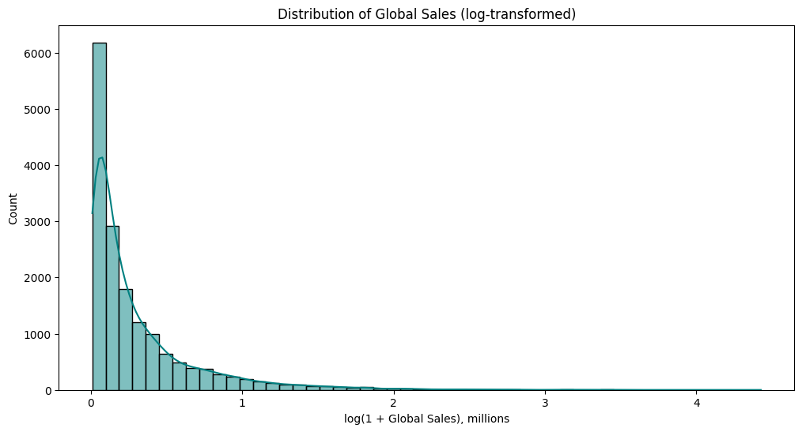

### Genre landscape
Action dominates both in volume (3,316 titles, 20% of the catalog) and total revenue (1,751M), followed by Sports and Shooter.

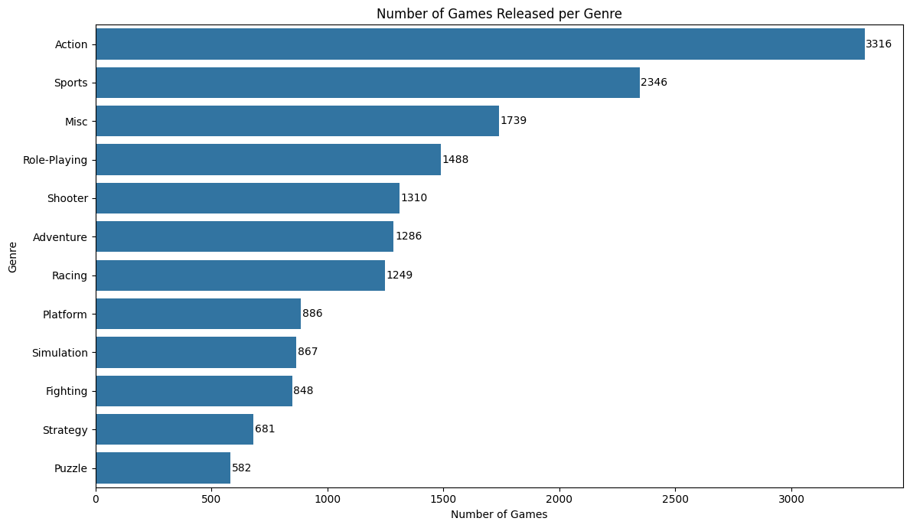
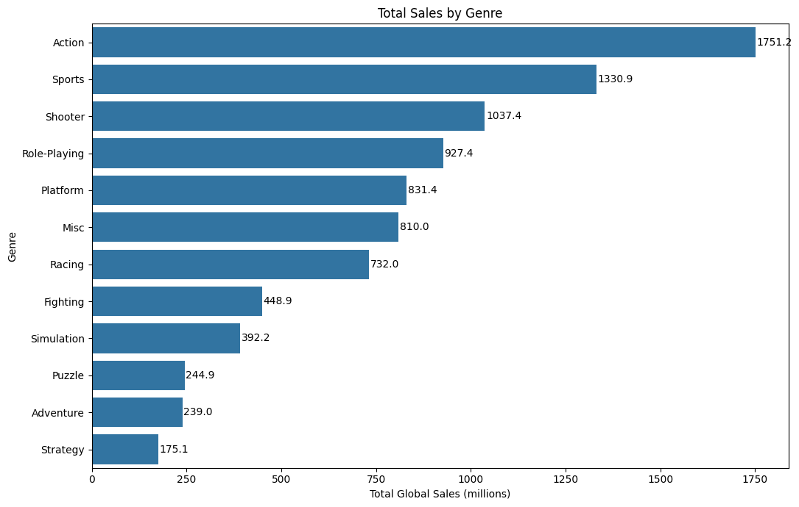
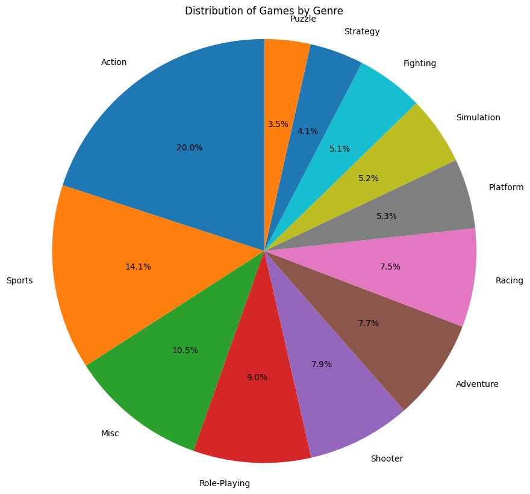

### Platforms
PS2 is the best-selling platform of all time (1,255.6M), ahead of Xbox 360 and PS3.

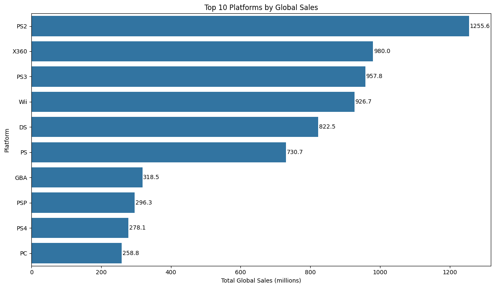

### Regional split
North America accounts for roughly half of global sales, Europe just over a quarter, and Japan about 14.5%.

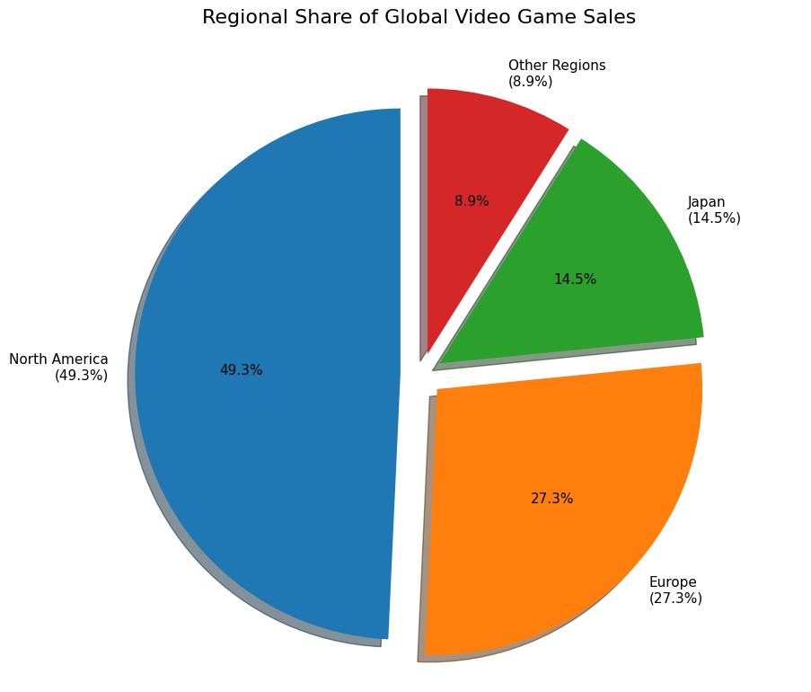

### Correlation between regional markets
NA and Global sales are almost perfectly correlated (0.94) — unsurprising given NA's market weight. Japan is the least correlated with the other regions (0.29–0.45), reflecting its distinct genre preferences (JRPGs over shooters, for instance).

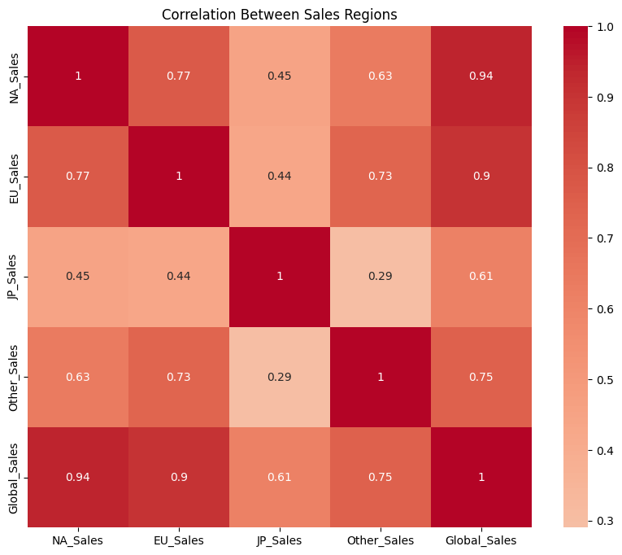

### Sales trend over time (missing-year rows excluded)
Global sales rose steadily from 1980, peaked around 2008–2009 (~680M/year), and declined sharply afterward — a decline that also reflects incomplete/older data for post-2015 releases in this dataset rather than a real market collapse.

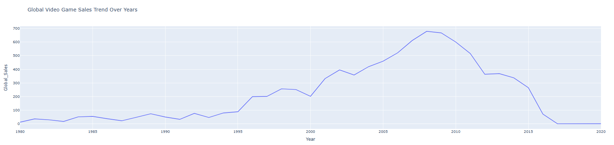

### Genre trends over time
Action overtook Sports and Shooter as the dominant genre from the mid-2000s onward.

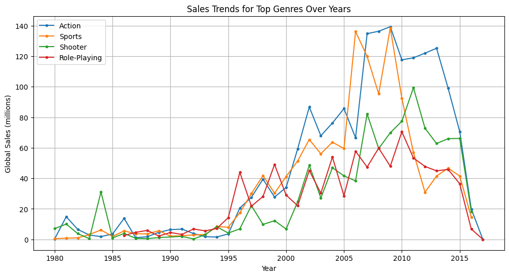


## Feature Engineering
The task was framed as **binary classification**: a game is labeled `Hit = 1` if its `Global_Sales` exceeds the dataset median, `0` otherwise. This avoids the difficulty (and leakage risk) of predicting an exact sales figure and instead answers a cleaner business question: *"is this combination of platform, genre, publisher and year associated with above-median success?"*

Key steps:
- **No sales columns used as features** (`NA_Sales`, `EU_Sales`, `JP_Sales`, `Other_Sales` are excluded) — including them would leak the target directly, since `Global_Sales` is derived from them.
- Rare publishers (outside the top 20 by frequency) were grouped into `"Other"` to control dimensionality before one-hot encoding.
- Categorical features (`Platform`, `Genre`, `Publisher_grouped`) were one-hot encoded; `Year` and the `Year_was_missing` flag were kept as numeric/binary features.
- Stratified 80/20 train-test split to preserve class balance.
- Features were standardized (`StandardScaler`) for Logistic Regression; tree-based models used the raw (unscaled) feature matrix.


## Machine Learning Models

Three classifiers were trained and compared: **Logistic Regression**, **Random Forest**, and **XGBoost**.

| Model | Accuracy | Precision | Recall | F1-Score | ROC-AUC |
|---|---|---|---|---|---|
| Logistic Regression | 0.7057 | 0.7080 | 0.6886 | 0.6982 | 0.7739 |
| Random Forest | 0.6834 | 0.6756 | 0.6917 | 0.6835 | 0.7462 |
| **XGBoost** | **0.7169** | **0.7098** | **0.7227** | **0.7162** | **0.7939** |

**XGBoost was the best-performing model** on every metric, with a ROC-AUC of 0.794 — meaning it's fairly good at ranking hit vs. non-hit games, well above the 0.5 random baseline.

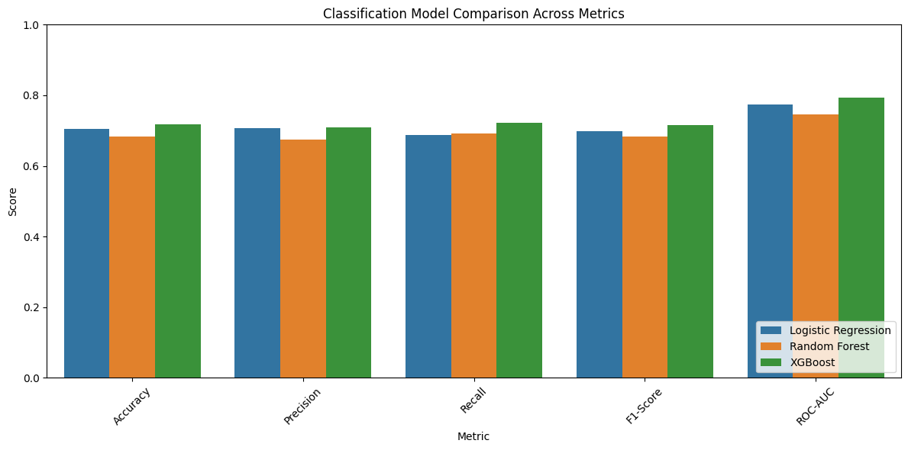
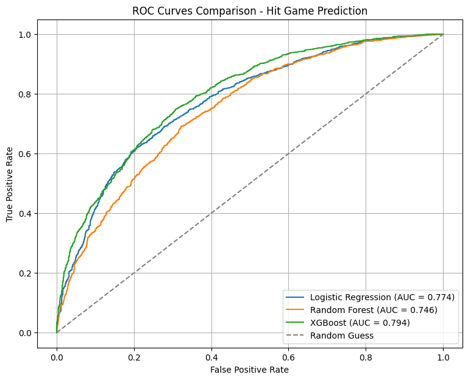
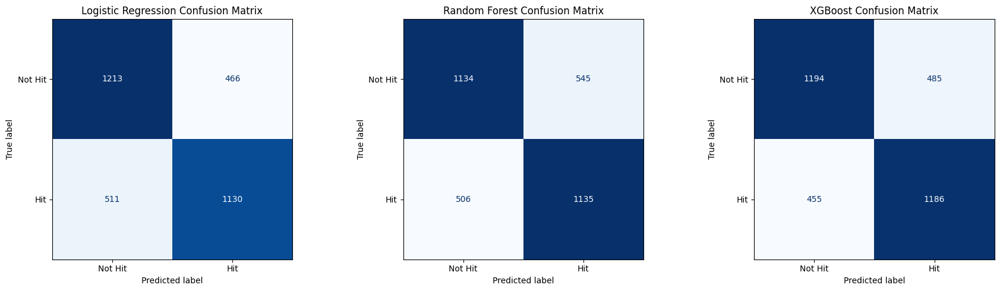

### Feature importance (Random Forest)
`Year` dominates feature importance by a wide margin, followed by publisher grouping (`Publisher_grouped_Other`, `Electronic Arts`, `Nintendo`) and a handful of genres (Adventure, Misc, Sports, Shooter). This makes intuitive sense: release timing correlates with market size and platform generation, and certain publishers/genres are structurally more likely to over-perform.

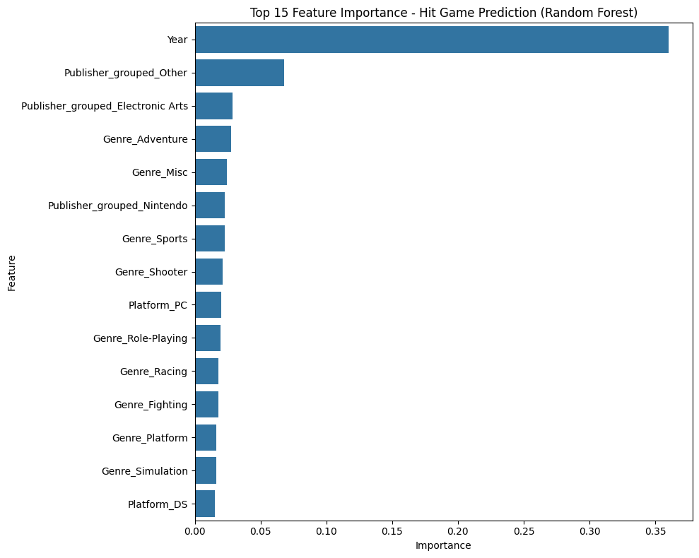


## Key Findings

- **Action is the single largest genre** by both volume (3,316 titles) and revenue (1,751M), but **Platform games have the highest average sales per title** (0.94M/game vs. Action's 0.53M) — fewer titles, but more consistently successful ones.
- **Nintendo has by far the highest average revenue per game** (2.54M/game across 703 titles) compared to Electronic Arts (0.82M/game across 1,351 titles) — Nintendo publishes less, but hits far more often.
- **North America drives roughly half of global sales**, but Japan shows a genre profile distinct enough that titles like *Monster Hunter Freedom 3* and *Dragon Quest* sell almost exclusively there.
- **PS2 remains the best-selling platform in history** in this dataset, ahead of Xbox 360, PS3, and Wii — a reminder that a platform's total install base and library size matter as much as any single blockbuster.
- **XGBoost outperformed both Logistic Regression and Random Forest** for hit prediction, suggesting the relationship between platform/genre/publisher/year and commercial success is non-linear enough to reward gradient boosting.
- **Release year is the single strongest predictor of "hit" status**, more so than genre or publisher — largely a proxy for market size and platform generation at the time of release, rather than a causal driver.


## Tech Stack

- **Data processing:** pandas, numpy
- **Database:** SQLite (via `sqlite3`)
- **Visualization:** matplotlib, seaborn, plotly
- **Machine Learning:** scikit-learn (Logistic Regression, Random Forest), XGBoost


## Project Structure

```
video-game-sales-analysis/
├── README.md
├── requirements.txt
├── data/
│   └── vgsales.csv.zip
├── sql/
│   └── queries.sql
├── notebooks/
│   └── vg_sales_analysis.ipynb
└── vgsales.db
```


## How to Run

```bash
git clone https://github.com/Emma-Shevchenko/video-game-sales-analysis.git
cd video-game-sales-analysis
pip install -r requirements.txt
jupyter notebook notebooks/vg_sales_analysis.ipynb
```


## Made by Emiliia Shevchenko
Created as a portfolio project demonstrating practical skills in SQL, Data Analysis, Visualization, and Machine Learning.
